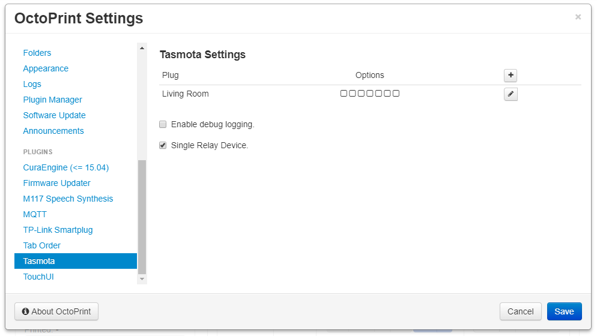

# OctoPrint-Tasmota

This plugin is to control devices that have been flashed with [Tasmota](https://github.com/arendst/Tasmota) via web calls.

**Requires minimum Tasmota firmware version 5.11.0.**

**Single relay devices need to use 1 for index.**

##  Screenshots

## Setup

Install via the bundled [Plugin Manager](https://github.com/foosel/OctoPrint/wiki/Plugin:-Plugin-Manager)
or manually using this URL:

    https://github.com/jneilliii/OctoPrint-Tasmota/archive/master.zip

## Configuration

Once installed go into settings and enter the ip address for your Tasmota device. Adjust additional settings as needed.

## Settings Explained

- ### General
  - **Enable thermal runaway monitoring.**
    - When enabled if temperatures exceed configured maximums enabled relay will be powered off.
    - **Max Bed Temp**
      - Maximum temperature bed can reach before automatic power off is triggered.
    - **Max Extruder Temp**
      - Maximum temperature extruders can reach before automatic power off is triggered.
  - **Error Event Monitoring**
    - When enabled if printer reports an error relays with the option enabled will be automatically powered off.
  - **Disconnect Event Monitoring**
    - When enabled if printer becomes disconnected relays with the option enabled will be automatically powered off.
  - **Upload Event Monitoring**
    - When enabled auto power on enabled devices when file is uploaded to OctoPrint with the option to automatically start printing.
    - **Include uploads via web interface**
      - Enable to auto power on when uploading via the web interface rather than from a Slicer with the option to automatically start.
      - **Automtically start print after on**
        - Enable to automatically start the print after the Tasmota device is powered on and printer auto connects.
  - **Connect Event Monitoring**
    - When enabled auto power on enabled devices when the Connect button is pressed in OctoPrint.
  - **Enable polling of status.**
    - When enabled the status of relays will be checked based on the Polling Interval supplied.
    - **Polling Interval**
      - How many minutes between status checks of all relays when polling is enabled.
  - **Cost per kWh**
    - Amount used to multiply total kWh by to estimate power cost. Leave 0 if you do not have a power reporting device.
  - **Request Timeout**
    - How many seconds to wait for responses from tasmota device before it is considered offline.
  - **Enable debug logging.**
    - Report additional information in plugin_tasmota_debug.log for troubleshooting.
  - **Power Off on Idle**
    - Automatically power off all relays with the option Off on Idle enabled after configured idle timeout, target tempoerature is reached, and timelapse is completed.
    - **Abort Power Off Timeout**
      - Pop up will be displayed for this amount of time in seconds to allow for delaying power off of relays.
    - **Idle Timeout**
      - Amount of time that will lapse before printer is considered idle and relays will be powered off.
    - **Idle Target Temperature**
      - Power off will be delayed until all heaters reach this temperature.
    - **GCode Commands to Ignore for Idle**
      - Comma separated list of gcode commands to ignore for determining printer idle state.
    - **Wait for Timelapse**
      - When enabled idle power off will wait for timelapse to complete before powering off. Uncheck this to not wait, helpful for very long prints and timelapse rendering.
- ### Device Specific
  - **IP**
    - The ip or hostname of tasmota device.
  - **Index**
    - Index of the relay, specifically used for multiple plug relay devices. Leave blank for single relay devices.
  - **Label**
    - Name to display on hover of the navbar button.
  - **Username**
    - Username to connect to web interface. Currently, not configurable in Tasmota, use the default username admin.
  - **Password**
    - Password configured for Web Admin Portal of Tasmota device.
  - **Verify**
    - Use this button to make sure that the plugin can communicate with your Tasmota device.
  - **On Color**
    - Color to display when device is on.
  - **Off Color**
    - Color to display when device is off.
  - **Unknown Color**
    - Color to display when device status is unknown.
  - **Icon Class**
    - Icon class name from the [fontawesome](https://fontawesome.com/icons?d=gallery&m=free) library.
  - **LED**
    - Is an LED or WS2812 type device connected, enter brightness value as percentage.
  - **Sensor Identifier**
    - Sensor identifier for connected sensors, ie DHT11 or BME280
  - **On with Upload**
    - Automatically power on when file is uploaded with the option to start printing automatically.
  - **On with Connect**
    - Automatically power on when pressing Connect button.
  - **Off on Idle**
    - Automatically power off when printer is idle.
  - **Thermal Runaway**
    - Power off if temperature exceeds configured max temperatures.
  - **Off on Error**
    - Automatically power off this relay when Error Event Monitoring is enabled.
  - **Off on Disconnect**
    - Automatically power off this relay when Disconnect Event Monitoring is enabled.
  - **Auto Connect**
    - Automatically connect to your printer after configured delay from power on.
  - **Auto Disconnect**
    - Automatically disconnect from printer and then power off relay after configured delay.
  - **Warning Prompt**
    - Prompt for confirmation before powering off via the navbar button.
  - **Warn While Printing**
    - Prompt for confirmation before powering off when a print is active.
  - **Use Countdown Timers**
    - Use Tasmota's built-in countdown functionality to offload the power operations. Helpful for safe shutdown of pi.
    - **On Delay Countdown**
      - Amount of delay in seconds for powering on device.
    - **Off Delay Countdown**
      - Amount of delay in seconds for powering off device.
  - **GCODE On / Off Trigger**
      - When checked this will enable the processing of M80 and M81 commands from gcode to power on/off plug.  Syntax for gcode command is M80/M81 followed by hostname/ip and index.  For example if your plug is 192.168.1.2 and index of 1 your gcode command would be **M80 192.168.1.2 1**
      - **GCODE On Delay**
        - Amount of delay in seconds before powering on device.
      - **GCODE Off Delay**
        - Amount of delay in seconds for powering off device.
  - **Run System Command After On**
    - When checked will run the system command configured in setting below after sending on command to device.
    - **System Command to Run**
      - System command to run after the on command is sent to device.
    - **Delay**
      - Delay in seconds before system command is run.
  - **Run System Command Before Off**
    - When checked will run the system command configured in setting below before sending off command to device.
    - **System Command to Run**
      - System command to run before the on command is sent to device.
    - **Delay**
      - Delay in seconds after system command is run before powering off device.

## Examples

- **Pi Safe Shutdown**
  
  With these options the raspberry pi will be shutdown 5 seconds after the idle timeout is reached (as configured on the main settings page) and send a backlog command to your Tasmota device to power off after a 60 second delay.

## Most recent changelog
**[1.0.4](https://github.com/jneilliii/OctoPrint-Tasmota/releases/tag/1.0.4)** (07/31/2021)
* fix bug with M150 command not having I parameter causing the command to get lost in the queue, #143
* make request timeout configurable in settings, #142
* add numeric StatusSTS messages for chk values, #150
* M118 support for LED commands for more real-time control based on what's happening on the printer (ie waiting for heat up). The function is similar to the M150 support but you will need to use the command `M118 TASMOTA_M150 I192.168.0.105 R### G### B### W### P###`
* account for energy data with multiple relay device, #155

### [All releases](https://github.com/jneilliii/OctoPrint-Tasmota/releases)

## Get Help

If you experience issues with this plugin or need assistance please use the issue tracker by clicking issues above.

### Additional Plugins

Check out my other plugins [here](https://plugins.octoprint.org/by_author/#jneilliii)

### Sponsors
- Andreas Lindermayr
- [@TheTuxKeeper](https://github.com/thetuxkeeper)
- [@tideline3d](https://github.com/tideline3d/)
- [SimplyPrint](https://simplyprint.io/)
- [Andrew Beeman](https://github.com/Kiendeleo)
- [Calanish](https://github.com/calanish)
- [Lachlan Bell](https://lachy.io/)
- [Jonny Bergdahl](https://github.com/bergdahl)
- [Leigh Johnson](https://github.com/leigh-johnson)
- [Stephen Berry](https://github.com/berrystephenw)
- [Steve Dougherty](https://github.com/Thynix)
## Support My Efforts
I, jneilliii, programmed this plugin for fun and do my best effort to support those that have issues with it, please return the favor and leave me a tip or become a Patron if you find this plugin helpful and want me to continue future development.

 

<small>No paypal.me? Send funds via PayPal to jneilliii&#64;gmail&#46;com</small>

