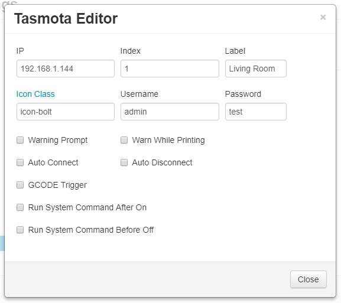

# OctoPrint-Tasmota

This plugin is to control ITead Sonoff devices that have been flashed with [Sonoff-Tasmota](https://github.com/arendst/Sonoff-Tasmota) via web calls.

**Requires minimum Tasmota firmware version 5.11.0.**

**Single relay devices need to use 1 for index.**

[Changelog](changelog.md)

##  Screenshots

## Setup

Install via the bundled [Plugin Manager](https://github.com/foosel/OctoPrint/wiki/Plugin:-Plugin-Manager)
or manually using this URL:

    https://github.com/jneilliii/OctoPrint-Tasmota/archive/master.zip

## Configuration

Once installed go into settings and enter the ip address for your TP-Link Smartplug device. Adjust additional settings as needed.

## Settings Explained

- **Device**
  - The ip or hostname of tasmota device.
- **Index**
  - Index number reprensenting the relay to control. Leave blank for single relay devices.
- **Icon**
  - Icon class name from the [fontawesome](https://fontawesome.com/v3.2.1/icons/) library.
- **Label**
  - Title attribute on icon that shows on mouseover.
- **Username**
  - Username to connect to web interface.  Currently not configurable in Tasmota, use the default username admin.
- **Password**
  - Password configured for Web Admin Portal of Tasmota device.
- **Warn**
  - The left checkbox will always warn when checked.
  - The right checkbox will only warn when printer is printing.
- **GCODE**
  - When checked this will enable the processing of M80 and M81 commands from gcode to power on/off plug.  Syntax for gcode command is M80/M81 followed by hostname/ip and index.  For example if your plug is 192.168.1.2 and index of 1 your gcode command would be **M80 192.168.1.2 1**
- **postConnect**
  - Automatically connect to printer after plug is powered on.
  - Will wait for number of seconds configured in **Auto Connect Delay** setting prior to attempting connection to printer.
- **preDisconnect**
  - Automatically disconnect printer prior to powering off the plug.
  - Will wait for number of seconds configured in **Auto Disconnect Delay** prior to powering off the plug.
- **Cmd On**
  - When checked will run system command configured in **System Command On** setting after a delay in seconds configured in **System Command On Delay**.
- **Cmd Off**
  - When checked will run system command configured in **System Command Off** setting after a delay in seconds configured in **System Command Off Delay**.
  
## Get Help

If you experience issues with this plugin or need assistance please use the issue tracker by clicking issues above.

### Additional Plugins

Check out my other plugins [here](https://plugins.octoprint.org/by_author/#jneilliii)

### Sponsors
- Andreas Lindermayr
- [@Mearman](https://github.com/Mearman)

### Support My Efforts
I, jneilliii, programmed this plugin for fun and do my best effort to support those that have issues with it, please return the favor and leave me a tip or become a Patron if you find this plugin helpful and want me to continue future development.

 

<small>No paypal.me? Send funds via PayPal to jneilliii&#64;gmail&#46;com</small>

